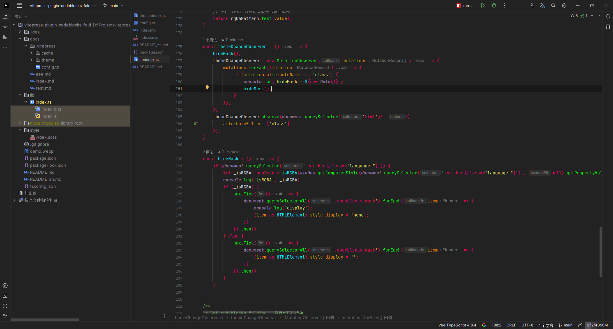

# Nano Monokai Theme

A high contrast UI theme based on Monikai spectrum. 
一款基于Monikai spectrum的魔改高对比度UI主题.

## Change Notes（更新日志）

<h3>1.0.3</h3>
<ul>
    <li>Adjust the border color of the popup component input box when it is focused to make it less dazzling.</li>
    <li>调整弹出框组件输入框聚焦时的边框颜色，使其不那么刺眼</li>
    <li>Project directory tree font contrast slightly increased.</li>
    <li>项目目录树字体对比度略微上调</li>
</ul>
<h3>1.0.2</h3>
<ul>
    <li>Change the display color of VCS and changed files.</li>
    <li>更改VCS及已变更文件的显示颜色</li>
</ul>
<h3>1.0.1</h3>
<ul>
    <li>Highlight project selected files.</li>
    <li>突出显示项目选定的文件</li>
</ul>

